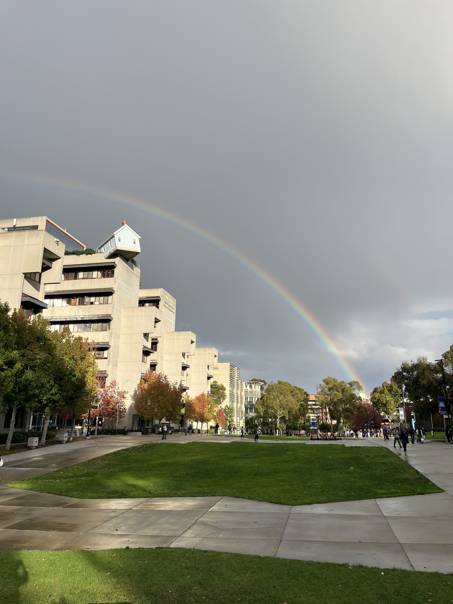

# CSE 110: Software Engineering
## Spring 2026
### Lab 1: VSCode, Markdown, and Git

## Pictures
**Fallen Star at JSOE**


*Sunset at Torry Pines*


<ins>Sunset on a Trail at Torry Pines</ins>


## Quote
> This is an example of a quote in Markdown


## Code
```
git branch new-branch  
git checkout new-branch
```

[CSE Website](https://cse.ucsd.edu/)  
[GitHub](https://github.com/)  
[YouTube](https://youtube.com/)  
[LeetCode](https://leetcode.com/)  
[HackerRank](https://www.hackerrank.com/)  

[This is a Link to the Pictures Header](###Pictures)  
[This is a Link to the Quote](###Quote)  
[This is a Link to the Code](###Code)  

[Relative Link to Image of Geisel Library](Pictures/IMG_0119.jpeg)  
[Relative Link to Image of Sunset](Pictures/IMG_0155.jpeg)  

## Curry Rice Recipe
### Ingredients
- 1 yellow onion
- 1 russet potato
- 2 medium-sized carrots
- 1 lb boneless chicken thighs
- 1 tbsp cooking oil
- Japanese curry roux
### Instructions
1. Peel the carrots and potatoes. Chop the carrots, chicken, onions, and potatoes into bite-sized pieces or however preffered. 
2. Place 1 tbsp of cooking oil in a pot over medium heat. Sauté the unions until they turn translucent, typically for 3 minutes. Then, place the chicken into the pot and mix for 4-5 minutes.
3. Place the carrots and potatoes into the pot and mix for 1 minute. Then, add water to the pot until all ingredients are fully covered. Bring pot to a boil for 1 minute.
4. Bring pot to medium-low heat for 12-15 minutes. Remove any excess foam that might appear at the top.
5. Break apart Japanese curry roux blocks and add them to the pot. Stir until the blocks are fully dissolved.
6. Serve the curry with cooked rice.

## To-Do
[] Pay Internet bill  
[x] Submit Final Draft of English Paper  
[] Take Biscut to the Vet for annual checkup